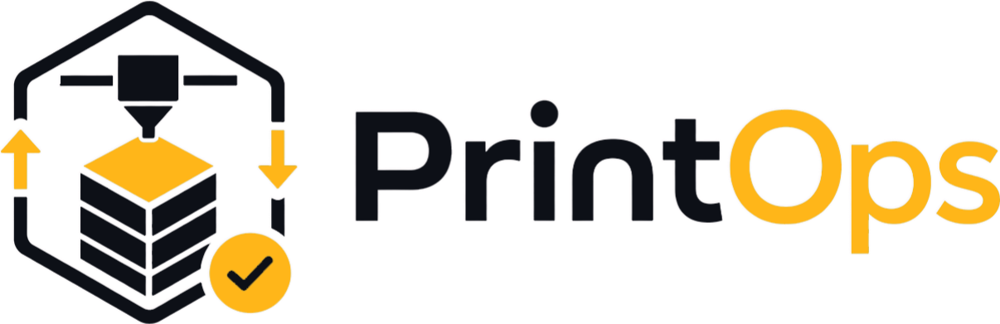

<p align="center">
  
</p>

<h1 align="center">PrintOps</h1>

<p align="center">
  <strong>From printer control to complete 3D-print operations.</strong><br>
  A local, self-hosted platform for hobbyists, print farms, small businesses, and developers.
</p>

<p align="center">
  <a href="https://github.com/ichwars/PrintOps/releases"></a>
  <a href="https://github.com/ichwars/PrintOps/actions/workflows/ci.yml"></a>
  <a href="https://github.com/ichwars/PrintOps/actions/workflows/codeql.yml"></a>
  <a href="https://github.com/ichwars/PrintOps/actions/workflows/security.yml"></a>
  <a href="LICENSE"></a>
</p>

<p align="center">
  <a href="#built-on-bambubuddy">Origin</a> ·
  <a href="#bambubuddy-and-printops">Comparison</a> ·
  <a href="#available-today">Capabilities</a> ·
  <a href="#where-printops-is-going">Direction</a> ·
  <a href="#quick-start">Quick start</a> ·
  <a href="docs/README.md">Documentation</a>
</p>

PrintOps brings the operational work around 3D printing into one place. It
combines a proven Bambu printer-management foundation with projects, inventory,
procurement, costing, customer, order, and document workflows. You can start
with one printer at home and keep the same platform as the work grows into a
farm or a business.

## Built on BambuBuddy

**PrintOps stands on the foundation created by
[maziggy](https://github.com/maziggy). His idea, creativity, and sustained work
turned Bambu printer management into a capable self-hosted platform with
[BambuBuddy](https://github.com/maziggy/bambuddy). We are sincerely grateful for
that foundation.**

**PrintOps is an independent fork. It preserves BambuBuddy's proven
printer-management core while pursuing a broader goal: connecting printing with
materials, costing, customers, orders, and business documents in one coherent
operations platform.**

The repositories now evolve independently, so their releases, migrations,
interfaces, and feature compatibility can diverge over time.

## BambuBuddy and PrintOps

The projects share a technical lineage but follow different product directions.
This comparison is about focus, not about declaring a winner.

| Area | BambuBuddy | PrintOps |
| --- | --- | --- |
| **Core purpose** | A self-hosted command center for Bambu printers and print farms | A broader operations platform built around 3D-print production |
| **Code lineage** | The original project and upstream foundation | An independent fork whose domain models, migrations, APIs, and workflows evolve separately |
| **Printer workflows** | The primary product focus | Retained as the operational production core |
| **Operational scope** | Deep printer control, automation, queues, archives, files, and fleet workflows | Extends printer operations with warehouse, procurement, costing, customer, order, and document workflows |
| **Interface** | A feature-rich printer command center | A separate PrintOps identity and navigation organized around Printers, Projects, Warehouse, and Orders |
| **Best fit** | Users primarily seeking deep Bambu printer control and automation | Hobbyists, farms, businesses, and developers who want production connected to the work around it |
| **Direction** | Continued depth in printer management and automation | An end-to-end flow from model and material to production, delivery, and compliant documents |

PrintOps is more than a visual rebrand, but that does not make BambuBuddy the
wrong choice. BambuBuddy remains a strong, focused project for users whose
primary need is printer control and automation.

## Who PrintOps is for

- **Hobbyists** get local control, useful automation, organized projects, and an
  inventory that can grow with the workshop.
- **Print-farm operators** get a shared view of printers, queues, files,
  materials, maintenance, and production work.
- **Small businesses** get the foundation for connecting stock, purchasing,
  costing, customers, quotations, orders, and documents.
- **Developers** get an AGPL-licensed, self-hosted Python and TypeScript codebase
  with automated tests, API-oriented services, and room for integrations.

## Available today

### Printer and production operations

- Real-time printer monitoring and control, queues, scheduling, archives,
  profiles, maintenance, cameras, and notifications.
- Projects and file-library workflows, including optional server-side slicing
  and reusable slicing pipelines.
- Multi-printer and print-farm workflows carried forward from the shared
  BambuBuddy foundation and adapted as PrintOps evolves.

### Warehouse and procurement

- Filament inventory plus structured storage locations and stock visibility.
- Material inventory for purchased parts, hardware, and consumables.
- Physical and reserved stock tracking, opening balances, minimum-stock signals,
  and auditable stock movements.
- Central supplier records with preferred and alternative procurement offers,
  package quantities, prices, links, and lead times for material and filament.

### Commercial foundation

- Business profiles, customer records, and permissions.
- Costing workspaces that connect project, material, machine, labor, and overhead
  data.
- Foundations for quotations, orders, reservations, invoices, and related
  commercial workflows.

### Platform

- Local, self-hosted operation with persistent data under your control.
- A Python/FastAPI backend and React/TypeScript frontend with REST and real-time
  interfaces.
- Role-based permissions, API keys, integrations, responsive layouts, and a
  multilingual interface.

## Where PrintOps is going

This is product direction, not a claim that every workflow below is complete in
the current release.

- **One connected operating flow:** enquiry → costing → quotation → order →
  purchasing and reservation → production → delivery → invoicing.
- **Complete business documents:** quotations, order confirmations, delivery
  notes, invoices, corrections, credit notes, reminders, and related records.
- **Standards-compliant electronic invoicing:** structured formats and validation
  for increasingly digital accounting workflows.
- **Deeper planning and traceability:** purchasing, production capacity,
  material demand, document history, reporting, and auditability.
- **A coherent product experience:** consistent workflows and visual language
  across printer operations, projects, warehouse, orders, and settings.

## Quick start

The supported installers configure PrintOps, persistent data, and logs. Docker
is the recommended deployment method.

**Linux or macOS:**

```bash
curl -fsSL https://raw.githubusercontent.com/ichwars/PrintOps/main/install/docker-install.sh -o docker-install.sh
chmod +x docker-install.sh
./docker-install.sh
```

**Windows PowerShell:**

```powershell
powershell -ExecutionPolicy Bypass -Command "iwr -useb https://raw.githubusercontent.com/ichwars/PrintOps/main/install/docker-install.ps1 -OutFile docker-install.ps1; .\docker-install.ps1"
```

Open `http://localhost:8000` after installation. Docker Desktop cannot provide
LAN printer auto-discovery, so Windows and macOS users may need to add printers
by IP. See the [complete installation guide](install/README.md) for Docker,
native installation, custom ports, updates, and troubleshooting.

## Development

The backend uses Python, FastAPI, and SQLAlchemy. The frontend uses React,
TypeScript, and Vite.

```bash
# Backend
python -m venv .venv
# Activate .venv for your shell, then:
pip install -r requirements.txt -r requirements-dev.txt
uvicorn backend.app.main:app --reload --host 0.0.0.0 --port 8000 --loop asyncio

# Frontend, in a second shell
cd frontend
npm install
npm run dev
```

The frontend development server runs on `http://localhost:5173` and proxies API
requests to the backend. The production frontend build is written to `static/`,
where the backend serves it.

Read [CONTRIBUTING.md](CONTRIBUTING.md) for prerequisites, issue and pull-request
workflow, code style, internationalization, permissions, tests, and required
documentation updates.

## Project status

PrintOps is under active development. The printer-management foundation is
broad and proven; the warehouse and commercial domains are evolving quickly.
Sections under **Available today** describe shipped capabilities. Sections under
**Where PrintOps is going** describe intended outcomes and must not be read as a
promise that every workflow is finished in the current release.

## Documentation and contributing

- [Documentation index](docs/README.md)
- [Installation guide](install/README.md)
- [Updating PrintOps](UPDATING.md)
- [Contributing guide](CONTRIBUTING.md)
- [Code of Conduct](CODE_OF_CONDUCT.md)
- [Security policy](SECURITY.md)

Contributions are welcome. Start with an issue so scope and direction can be
agreed before implementation.

## License, origin, and independence

PrintOps is licensed under the [GNU Affero General Public License v3.0](LICENSE).
When you distribute a modified version or provide access to it over a network,
the corresponding source must be made available under the terms of the AGPL.

PrintOps is an independent fork of BambuBuddy. It is not affiliated with,
maintained by, or endorsed by Bambu Lab. Bambu Lab, Bambu Studio, MakerWorld,
and related names are trademarks of their respective owners.
